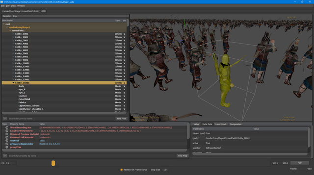

# Golaem For USD

Golaem For USD is a plugin which takes advantage of USD Dynamic Payloads to render Golaem Simulation Caches within USD compatible applications.
Thus, it avoids baking out geometry, handles geometry and shading variation and Golaem Layout edits.

## License
Golaem For USD is licensed under Apache 2.0

See [license file](LICENSE.md)

## Contributing
You can find more information about how to contribute to this project [here](CONTRIBUTING.md)

## Prerequisites
- [Golaem 7.2.3 For Maya (or above)](http://download.golaem.com)
- USD 0.19.11
- FBX SDK 2019.0
> Please use the same version of Golaem For Maya as the Golaem For USD tag you're compiling

## Documentation
Official documentation for the plugin can be found here: [http://usd.golaem.com](http://usd.golaem.com)

## Compilation
1. Use CMake 3.13 (or above) and set the GOLAEMUSD_STANDALONE_BUILD to True
2. Locate the Golaem For Maya Devkit, USD build and FBX SDK Directories
3. Configure and Generate your solution
4. Open the generated solution with your favorite IDE 

## Changelog
Changelog for the plugin can be found here: [ChangeLog](CHANGELOG)

## Code of Conduct

### Our Pledge

We as members, contributors, and leaders pledge to make participation in our community a safe, inclusive and harassment-free experience for everyone, regardless of age, body size, visible or invisible disability, ethnicity, sex characteristics, gender identity and expression, level of experience, education, socio-economic status, nationality, personal appearance, race, religion, or sexual identity and orientation. We pledge to act and interact in ways that contribute to an open, welcoming, diverse, inclusive and healthy community.

### Our Standards

Our Open Source Community works to:

- Be kind towards other people which enables us to be empathic to each other
- Be respectful of differing opinions, viewpoints, and experiences
- Give and gracefully accept constructive feedback
- Accept responsibility and apologize to those affected by our mistakes, and learning from the experience
- Focus on what is best not just for us as individuals, but for the overall community

We will not tolerate the following behaviors:

- Violent threats or language
- The use of sexualized language or imagery, and sexual attention or advances of any kind
- Trolling, insulting or derogatory comments, and personal or political attacks
- Public or private harassment
- Publishing others’ private information, such as a physical or email address, without their explicit permission
- Other conduct which could reasonably be considered inappropriate in a professional setting